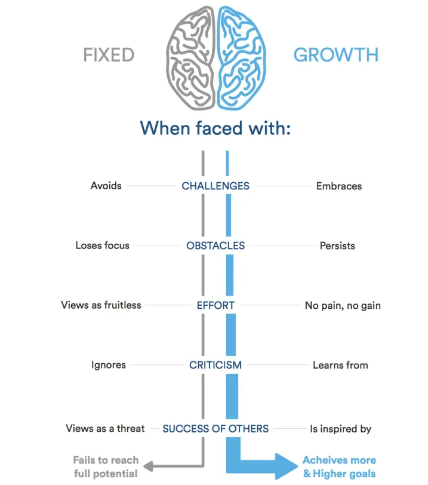

# reading-notes

## What is a growth mindset?

A growth mindset believes that one’s fundamental abilities can be developed through perseverance and effort; intelligence and talent are simply good starting points. A growth mindset is synonymous with a love of learning.
### there is two types of mindset:
 1. fixed mindset
 2. growth mindset

## How you can benefit from a growth mindset?

 * The growth mindset can open pathways to more creativity and possibility
 * it enable the setting of higher goals and more achievement.
 
***so now we now what is growth minset***

